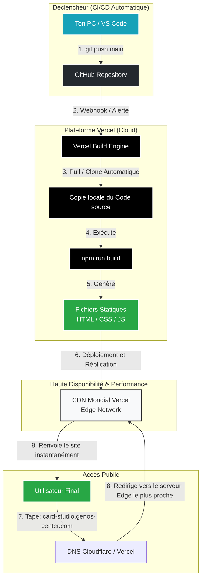

 

```mermaid
graph TD
    %% Couleurs et styles
    style A fill:#17a2b8,stroke:#fff,stroke-width:2px,color:#fff;
    style B fill:#24292e,stroke:#fff,stroke-width:2px,color:#fff;
    style C fill:#000,stroke:#fff,stroke-width:2px,color:#fff;
    style D fill:#000,stroke:#fff,stroke-width:2px,color:#fff;
    style E fill:#000,stroke:#fff,stroke-width:2px,color:#fff;
    style F fill:#28a745,stroke:#fff,stroke-width:2px,color:#fff;
    style G fill:#f8f9fa,stroke:#333,stroke-width:2px,color:#333;
    style H fill:#28a745,stroke:#fff,stroke-width:2px,color:#fff;

    subgraph sg1["Déclencheur (CI/CD Automatique)"]
        A[Ton PC / VS Code] -->|1. git push main| B[GitHub Repository]
    end

    %% Section 2: Vercel Pipeline
    subgraph sg2["Plateforme Vercel (Cloud)"]
        B -->|2. Webhook / Alerte| C[Vercel Build Engine]
        C -->|3. Pull / Clone Automatique| D[Copie locale du Code source]
        D -->|4. Exécute| E[npm run build]
        E -->|5. Génère| F[Fichiers Statiques <br> HTML / CSS / JS]
    end

    %% Section 3: Distribution (CDN)
    subgraph sg3["Haute Disponibilité & Performance"]
        F -->|6. Déploiement et Réplication| G[CDN Mondial Vercel <br> Edge Network]
    end

    %% Section 4: Accès Utilisateur
    subgraph sg4["Accès Public"]
        H[Utilisateur Final] -->|7. Tape: card-studio.genos-center.com| I[DNS Cloudflare / Vercel]
        I -->|8. Redirige vers le serveur Edge le plus proche| G
        G -->|9. Renvoie le site instantanément| H
    end


 
```