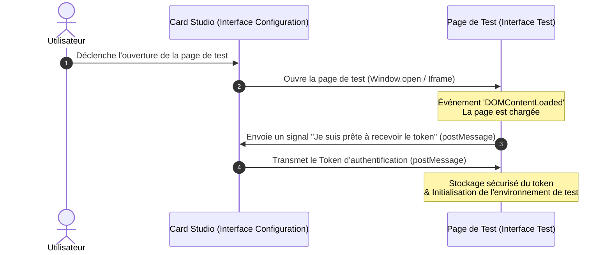

```mermaid
sequenceDiagram
    autonumber
    actor Utilisateur
    participant CS as Card Studio (Interface Configuration)
    participant PT as Page de Test (Interface Test)

    Utilisateur->>CS: Déclenche l'ouverture de la page de test
    CS->>PT: Ouvre la page de test (Window.open / Iframe)
    
    Note over PT: Événement 'DOMContentLoaded'<br/>La page est chargée
    PT->>CS: Envoie un signal "Je suis prête à recevoir le token" (postMessage)
    
    CS->>PT: Transmet le Token d'authentification (postMessage)
    Note over PT: Stockage sécurisé du token<br/>& Initialisation de l'environnement de test


```
