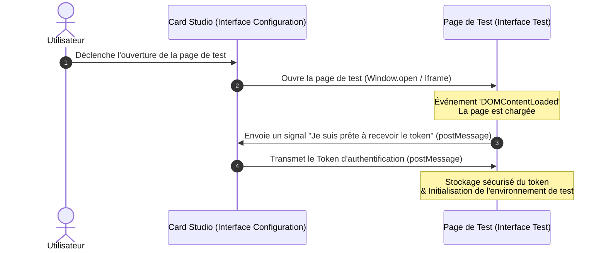

```mermaid
sequenceDiagram
    autonumber
    
    actor User as Utilisateur
    
    %% --- COUCHE BOUNDARY (Interface) ---
    box LightBlue Interface (Boundary)
        participant Front@{ "type" : "boundary" }  as Studio Tester (UI)
    end
    
    %% --- COUCHE CONTROL (Logique métier) ---
    box LightYellow Métier (Control)
        participant API@{ "type" : "control" } 
        participant WS@{ "type" : "control" } as Serveur Websocket ( moteur )
    end
    
    %% --- COUCHE ENTITY & DATA (Données) ---
    box LightGreen Persistance (Entity / DB)
        participant Game as Mémoire vive du serveur (Entity)
        participant DB@{ "type" : "database" } as Base de Données
    end

    Note over User, Front: Phase d'Initialisation & Auth
    User->>Front: Lance le test d'une partie
    activate Front
    
    Front->>API: Vérifie Token & Demande la Game
    activate API
    
    alt Token Invalide
        API-->>Front: Erreur 401 (Unauthorized)
        Front-->>User: Affiche écran de reconnexion
        
    else Token Valide
        %% Le Control interroge l'Entité/DB
        API--)DB: Requête des données de la Game
        activate DB
        DB-->>API: Données brutes SQL/NoSQL
        deactivate DB
        
        API-->>Front: Hydrate et renvoie l'état (JSON)
        deactivate API
    
        Note over Front, WS: Connexion & Création de session
        Front->>WS: Demande de création de session "test"
        activate WS
        
        %% Le contrôleur WebSocket instancie et manipule l'entité métier
        WS->>Game: Initialise l'état de la partie
        activate Game
        Game-->>WS: Instance "GameSession" prête
        deactivate Game
        
        WS-->>Front: Confirmation (Session active)
        deactivate WS
    end

    rect rgb(250, 255, 250,250)
        loop Boucle de Test (Temps réel)
            User->>Front: Effectue une action de jeu
            Front->>WS: Envoie l'action (Event)
            activate WS
            
            WS->>Game: Met à jour l'état (Applique les règles de jeu)
            activate Game
            Game-->>WS: Nouvel état calculé
            deactivate Game
            
            WS-->>Front: Broadcast le nouvel état à tous les testeurs
            deactivate WS
            Front-->>User: Met à jour l'affichage
        end
    end

    Note over Front, DB: Sauvegarde de fin de test (Optionnel)
    WS->>DB: Persiste l'état final si besoin
    activate DB
    DB-->>WS: OK
    deactivate DB
 
```