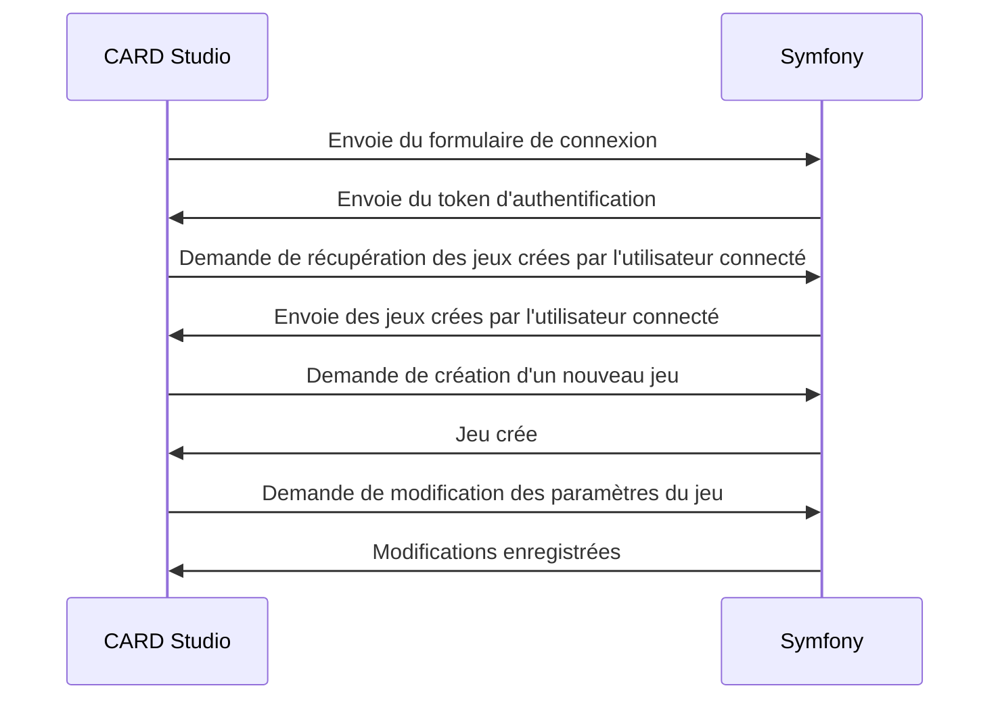

 
# Concept
il y a deux applications : 
- CARD Studio qui permet de créer des jeux de cartes personnalisés, en modifiant n’importe quel élément du jeu et/ou paramètre de la logique.
- Quant à CARD Games, il permet d’accueillir les joueurs ; ils arrivent sur une interface leur permettant de se connecter avec un code et ils rejoignent un menu leur demandant leur pseudo. Ils peuvent sinon choisir de créer une partie parmi plusieurs jeux publics proposés. Dans le cas où un utilisateur de CARD Studio a créé un jeu complet en privé, il obtiendra un code unique. Sur CARD Games, les joueurs pourront alors créer une partie à partir d’un code d’un jeu et non d’un jeu public.

# Le stack
CARD Games et CARD Studio sont deux applications React ; elles communiquent toutes les deux avec la base de données (le backend) qui est développé avec Symfony et une base PostgreSQL. Pour gérer la connexion simultanée de chaque joueur, il doit y avoir un serveur Node.js disponible ; il communique uniquement avec CARD Games. 

 
# Création d'un jeu

 

