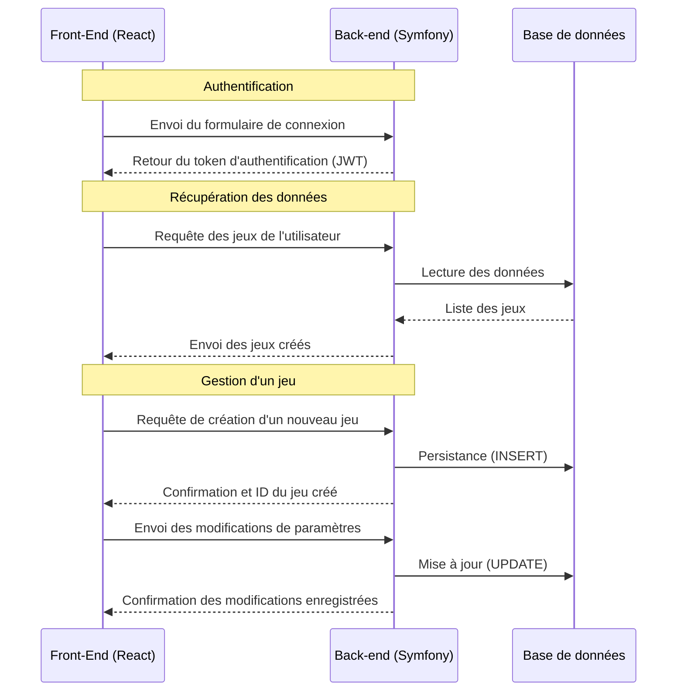

 
# Concept
il y a deux applications : 
- CARD Studio qui permet de créer des jeux de cartes personnalisés, en modifiant n’importe quel élément du jeu et/ou paramètre de la logique.
- Quant à CARD Games, il permet d’accueillir les joueurs ; ils arrivent sur une interface leur permettant de se connecter avec un code et ils rejoignent un menu leur demandant leur pseudo. Ils peuvent sinon choisir de créer une partie parmi plusieurs jeux publics proposés. Dans le cas où un utilisateur de CARD Studio a créé un jeu complet en privé, il obtiendra un code unique. Sur CARD Games, les joueurs pourront alors créer une partie à partir d’un code d’un jeu et non d’un jeu public.

# L'application
L'application CARD Studio permet de configurer l'intégralité d'un jeu. En tant qu'interface utilisateur (Front-end), elle regroupe l'ensemble des formulaires de configuration et offre une expérience intuitive pour faciliter le processus de création.
 


# Stack technique
- Front-end : React
- Back-end : Symfony (API Rest), en charge de la logique métier et de la gestion de la base de données.
- Flux de données : Les informations saisies sur l'interface React sont transmises à l'API Symfony, qui assure la persistance des données en base.


# Création d'un jeu

 

```mermaid

sequenceDiagram
    participant React as Front-End (React)
    participant Symfony as Back-end (Symfony)
    participant DB as Base de données

    Note over React, Symfony: Authentification
    React->>Symfony: Envoi du formulaire de connexion
    Symfony-->>React: Retour du token d'authentification (JWT)

    Note over React, Symfony: Récupération des données
    React->>Symfony: Requête des jeux de l'utilisateur
    Symfony->>DB: Lecture des données
    DB-->>Symfony: Liste des jeux
    Symfony-->>React: Envoi des jeux créés

    Note over React, Symfony: Gestion d'un jeu
    React->>Symfony: Requête de création d'un nouveau jeu
    Symfony->>DB: Persistance (INSERT)
    Symfony-->>React: Confirmation et ID du jeu créé

    React->>Symfony: Envoi des modifications de paramètres
    Symfony->>DB: Mise à jour (UPDATE)
    Symfony-->>React: Confirmation des modifications enregistrées

```


# 🚀 CARDGames - Front-end (React + Docker Hybride)

Ce projet utilise une architecture Docker avancée dite **"Multi-Stage"** (étapes multiples). Un seul et unique `Dockerfile` gère deux environnements totalement différents : le **Développement** local sur votre machine et la **Production** sécurisée pour le serveur.


## 🧠 Architecture du Dockerfile : La Dualité Dev/Prod

Pour optimiser les ressources et garantir la maintenabilité, le `Dockerfile` est découpé en cibles (`targets`) :


```
      [ ÉTAPE COMMUNE : Installation des dépendances (Node.js) ]
                                  │
               ┌──────────────────┴──────────────────┐
               ▼                                     ▼
   [ CIBLE 1 : DEV LOCAL ]               [ CIBLE 2 : BUILD PROD ]
   • Lance "npm run dev"                 • Compile le code React (Vite/CRA)
   • Node.js reste actif                 • Génère les fichiers HTML/CSS/JS statiques
   • Idéal pour coder (Live Reload)                      │
                                                         ▼
                                            [ CIBLE 3 : APACHE FINAL ]
                                            • Reçoit les fichiers compilés
                                            • Supprime Node.js et le code source brut
                                            • Serveur web ultra-léger et sécurisé


```

*   **En Développement (Local) :** Le fichier `docker-compose.yml` cible uniquement l'étape `dev` (`target: dev`). Node.js tourne en continu pour recharger votre site dès que vous modifiez un fichier.
*   **En Production (Proxmox) :** Le script de déploiement continu (CD) cible l'étape `prod` (`--target prod`). Le serveur Proxmox ne stocke **jamais le code source**, mais uniquement l'image Apache finale contenant le site compilé, masqué derrière le tunnel Cloudflare.


## 🛠️ Commandes pour Lancer le Projet en Dev

*   **Démarrer l'application (et forcer la construction) :**
    ```bash
    docker compose up --build -d
    ```
    *(L'option `--build` est obligatoire la première fois ou dès que vous ajoutez un nouveau package avec `npm install`).*

*   **Arrêter l'application :**
    ```bash
    docker compose down
    ```

*   **Consulter les logs en direct (utile en cas de bug) :**
    ```bash
    docker compose logs -f
    ```


## 🏗️ Commande pour Compiler la Production (Pour info)

Si vous souhaitez tester la version de production Apache localement sans passer par le script de CD :
```bash
docker build --target prod -t card-studio:prod .
```


## 🔍 Guide de Dépannage (Troubleshooting)

### 1. Erreur : "Ce site est inaccessible" / Connexion refusée

* **Pourquoi ?** Par défaut, les serveurs de développement (comme Vite ou CRA) écoutent uniquement sur `localhost` (127.0.0.1) *à l'intérieur* de leur conteneur. Docker ne peut donc pas transférer le flux vers votre machine externe.
* **Solution pour Vite :** Ouvrez votre fichier `package.json` et ajoutez le drapeau `--host` au script de démarrage :
```json
"scripts": {
  "dev": "vite --host"
}

```


* **Solution pour Create React App (CRA) :** Ajoutez la variable d'environnement `HOST=0.0.0.0` dans votre fichier `docker-compose.yml` :
```yaml
environment:
  - HOST=0.0.0.0
  - WATCHPACK_POLLING=true
```


*Après cette modification, relancez avec `docker compose up --build -d`.* 