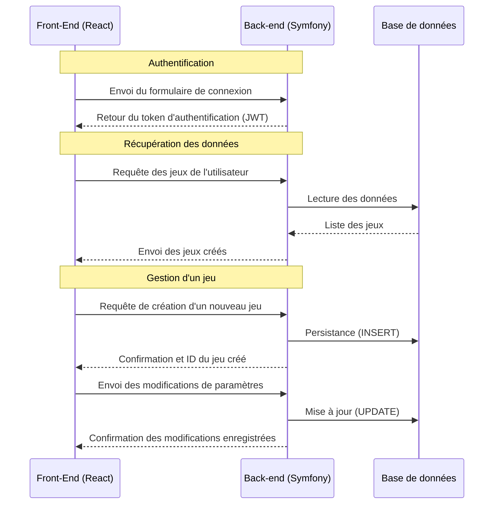

 
# Concept
il y a deux applications : 
- CARD Studio qui permet de créer des jeux de cartes personnalisés, en modifiant n’importe quel élément du jeu et/ou paramètre de la logique.
- Quant à CARD Games, il permet d’accueillir les joueurs ; ils arrivent sur une interface leur permettant de se connecter avec un code et ils rejoignent un menu leur demandant leur pseudo. Ils peuvent sinon choisir de créer une partie parmi plusieurs jeux publics proposés. Dans le cas où un utilisateur de CARD Studio a créé un jeu complet en privé, il obtiendra un code unique. Sur CARD Games, les joueurs pourront alors créer une partie à partir d’un code d’un jeu et non d’un jeu public.

# L'application
L'application CARD Studio permet de configurer l'intégralité d'un jeu. En tant qu'interface utilisateur (Front-end), elle regroupe l'ensemble des formulaires de configuration et offre une expérience intuitive pour faciliter le processus de création.
 

# Stack technique
- Front-end : React
- Back-end : Symfony (API Rest), en charge de la logique métier et de la gestion de la base de données.
- Flux de données : Les informations saisies sur l'interface React sont transmises à l'API Symfony, qui assure la persistance des données en base.

# Création d'un jeu

 

```mermaid

sequenceDiagram
    participant React as Front-End (React)
    participant Symfony as Back-end (Symfony)
    participant DB as Base de données

    Note over React, Symfony: Authentification
    React->>Symfony: Envoi du formulaire de connexion
    Symfony-->>React: Retour du token d'authentification (JWT)

    Note over React, Symfony: Récupération des données
    React->>Symfony: Requête des jeux de l'utilisateur
    Symfony->>DB: Lecture des données
    DB-->>Symfony: Liste des jeux
    Symfony-->>React: Envoi des jeux créés

    Note over React, Symfony: Gestion d'un jeu
    React->>Symfony: Requête de création d'un nouveau jeu
    Symfony->>DB: Persistance (INSERT)
    Symfony-->>React: Confirmation et ID du jeu créé

    React->>Symfony: Envoi des modifications de paramètres
    Symfony->>DB: Mise à jour (UPDATE)
    Symfony-->>React: Confirmation des modifications enregistrées

```

https://labex.io/fr/tutorials/git-how-to-address-fatal-bad-object-head-error-417639

git fetch origin

https://www.swyx.io/solve-git-bad-object-head